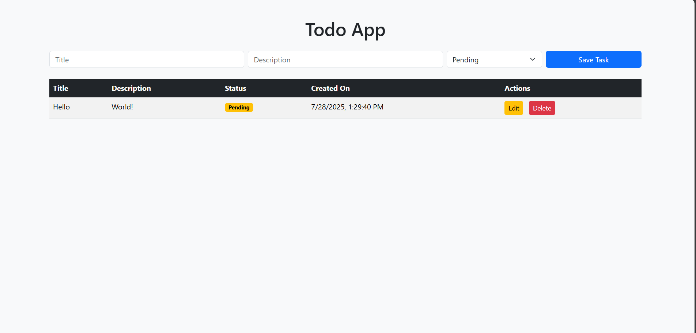
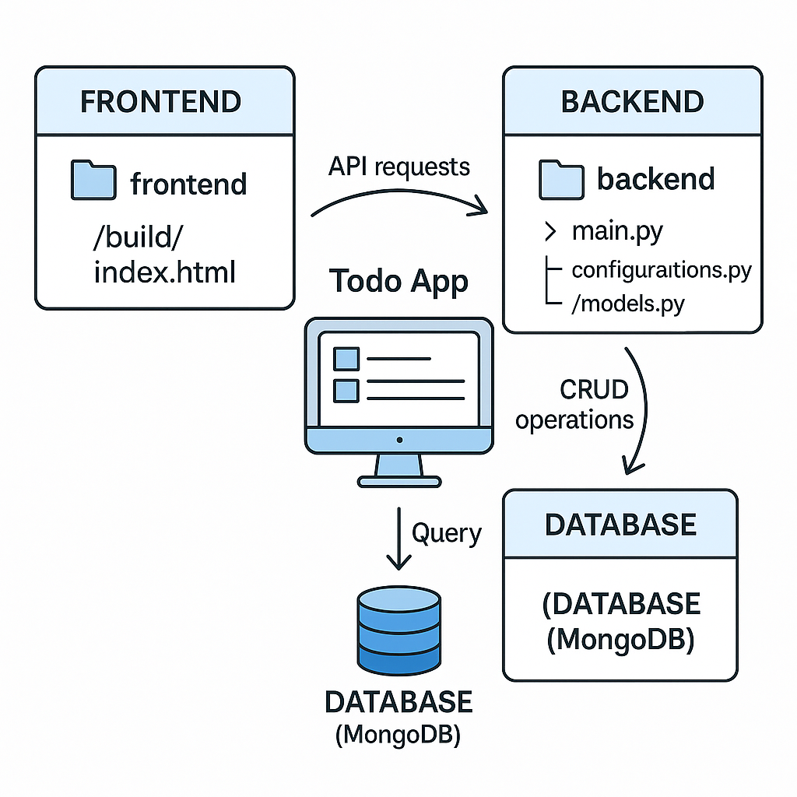

# 📝 Todo App – Full Stack Project (FastAPI + MongoDB + HTML/JS)

 

## 📌 Overview

This is a beginner-friendly full-stack **Todo App** that connects:

* 📦 **Backend:** FastAPI (Python)
* 🗃️ **Database:** MongoDB (Cloud-hosted using MongoDB Atlas)
* 🖥️ **Frontend:** HTML + CSS + JavaScript (static `index.html`)

This project is **perfect for beginners** who want to learn:

* How to build and structure backend APIs using **FastAPI**
* How to connect backend with **MongoDB Atlas**
* How to consume APIs in a **static frontend**
* How to manage **CRUD operations** (Create, Read, Update, Delete) using REST

---

## 📁 Project Structure

```
Todo-App/
│
├── backend/
│   ├── main.py                # Main FastAPI application
│   ├── configurations.py      # MongoDB connection config
│   └── Database/
│       ├── models.py          # Pydantic models for request validation
│       └── schemas.py         # Database helper functions
│
└── frontend/
    └── build/
        └── index.html         # Frontend UI (HTML, CSS, JS)
```

---

## 🚀 How It Works

### Backend (FastAPI)

* All APIs are defined in `main.py`
* MongoDB connection is handled in `configurations.py`
* Database logic like formatting and data transformation lives in `schemas.py`
* Data validation is done using `pydantic` models in `models.py`

### API Endpoints

| Method   | Endpoint      | Description            |
| -------- | ------------- | ---------------------- |
| `GET`    | `/todos`      | Fetch all todos        |
| `POST`   | `/todos`      | Create a new todo      |
| `PUT`    | `/todos/{id}` | Update a todo by ID    |
| `DELETE` | `/todos/{id}` | Soft delete todo by ID |

### Smart Features

* `is_deleted: true` will **hide** the todo from frontend without fully removing it.
* `is_completed: true` is shown as “Completed”, else “Pending”.
* `created_on` and `updated_at` are automatically handled by backend.
* Date is sent in timestamp format and converted to readable form in frontend.

---

### Frontend (Static HTML/JS)

* All frontend logic is in a single file: `index.html`
* AJAX (`fetch`) is used to make API calls to backend.
* DOM is dynamically updated based on API responses.
* Styling is done using simple CSS classes inside the same file.

### API Integration in HTML

```js
// Fetch all tasks
fetch("http://localhost:8000/todos")
  .then(res => res.json())
  .then(data => {
    // Loop and render tasks to DOM
  });

// Create new task
fetch("http://localhost:8000/todos", {
  method: "POST",
  headers: { "Content-Type": "application/json" },
  body: JSON.stringify({ title: "Task", description: "Desc" })
});
```

---

## 🛠️ Installation & Run

### 1. Clone the repository

```bash
git clone https://github.com/your-username/todo-app
cd todo-app
```

### 2. Setup & Run Backend

#### 🐍 Create virtual environment (optional)

```bash
cd backend
python -m venv venv
venv\Scripts\activate   # Windows
# source venv/bin/activate  # macOS/Linux
```

#### 📦 Install dependencies

```bash
pip install fastapi uvicorn pymongo python-dotenv
```

#### 🔗 Connect MongoDB

* Use MongoDB Atlas and get your connection string
* Add it in `configurations.py`

```python
MONGO_URI = "your_mongodb_connection_string"
```

#### ▶️ Run FastAPI Server

```bash
uvicorn main:app --host 0.0.0.0 --port 8000 --reload
```

*If deploying to platforms like Replit, use:*

```bash
uvicorn main:app --host 0.0.0.0 --port $PORT --reload
```

### 3. Open Frontend

* Go to `frontend/build/index.html`
* Open it directly in browser (or serve using Python if needed)

```bash
cd frontend/build
python -m http.server
```

---

## 💡 Why This Project is Great for Beginners?

* ✅ Simple structure: no React, no complex tools — just HTML + JS
* ✅ All logic is easy to trace: no magic, no frameworks
* ✅ Real-world backend: connects to a real database (MongoDB)
* ✅ RESTful API: learn GET, POST, PUT, DELETE
* ✅ No deployment stress: run locally, see everything live

---

## 📸 Preview

 

---

## 🧠 Future Improvements (if you're curious)

* Add search/filter
* Deploy backend to Render/Heroku
* Make frontend responsive
* Use localStorage to store user preferences
* Add user login via JWT (optional advanced)

---

## 🙌 Contribute

If you’re just starting and want to try things out — feel free to fork, break, fix, and improve this project!

---
